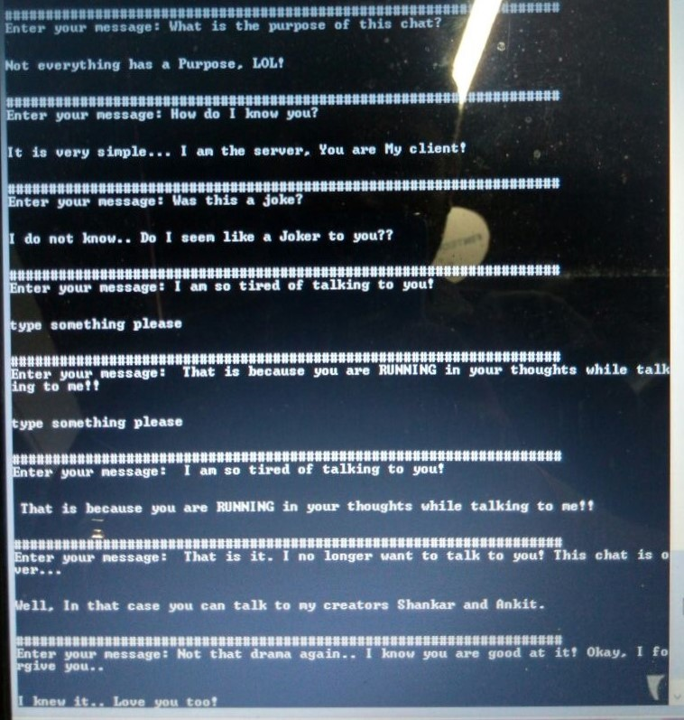

# Python-GRPC-Chatbot
> Creating a Chatbot using python prtobuf and grpc


Protobuf is used to serialize a message while sending data over network, this file is using GRPC to send data from client to server.



## Installation

Windows, OS X & Linux::

```sh
Install requirements ($ pip3 install -r requirements.txt)
Note: In case if installation doesn't work check protobuf installation for your Operating system.
```


## Usage example

This can be used to send the serialized data over network which is faster as compared to other serialization.

Code example: 

Navigate to my_work folder and run this code to create bindings

```sh
python -m grpc_tools.protoc -I. --python_out=. --grpc_python_out=. chatbot.proto

```

Now open two shell and run the below code in two different shell


```sh
python client.py

```
```sh
python server.py

```

    

Output example: 

```sh
Enter your message: good afternoon # Client Request


good afternoon, how you doing # Server Response
```


## Meta

Your Name – [@Skhk634](https://twitter.com/Skhk634) – shankarj67@gmail.com


Distributed under the mit license. See ``LICENSE`` for more information.

[https://github.com/shankarj67/GRPC-Hackathon](https://github.com/shankarj67/)

## Contributing

1. Fork it (<https://github.com/shankarj67/GRPC-Hackathon>)
2. Create your feature branch (`git checkout -b feature/fooBar`)
3. Commit your changes (`git commit -am 'Add some fooBar'`)
4. Push to the branch (`git push origin feature/fooBar`)
5. Create a new Pull Request

